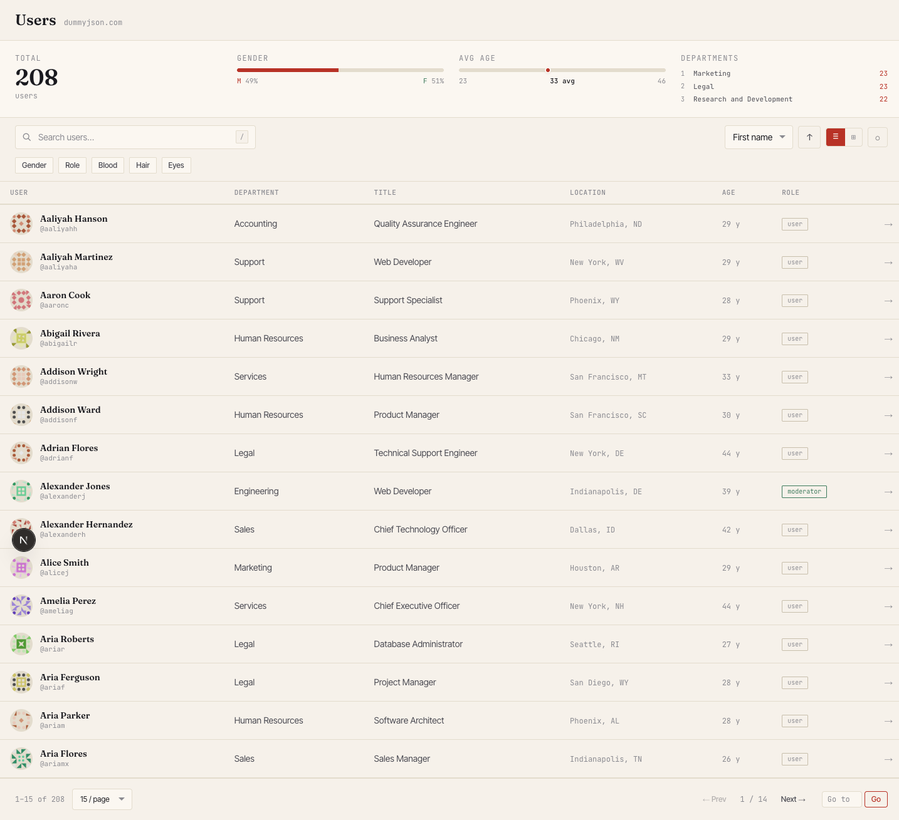
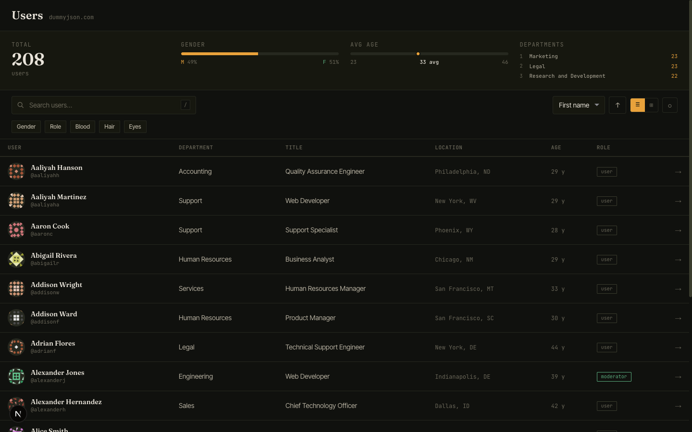
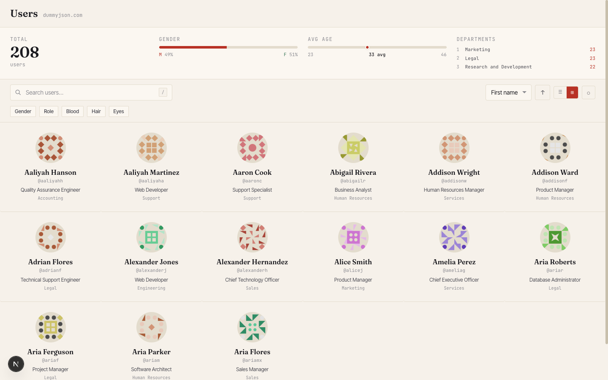
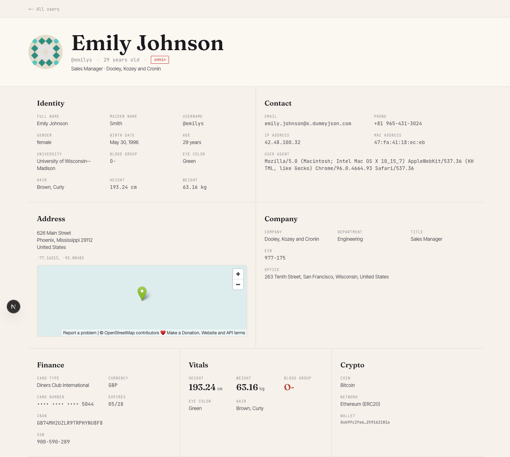

# Users Dashboard

Дашборд для просмотра и изучения профилей пользователей на основе [DummyJSON API](https://dummyjson.com/docs/users).



---

## Скриншоты

| Light mode | Dark mode |
|---|---|
|  |  |

| Gallery view | User profile |
|---|---|
|  |  |

---

## Запуск

```bash
pnpm install
pnpm dev
```

Открыть: [http://localhost:3000](http://localhost:3000)

### Все скрипты

| Команда | Описание |
|---|---|
| `pnpm dev` | Dev-сервер с Turbopack |
| `pnpm build` | Production-сборка |
| `pnpm start` | Запуск production-сборки |
| `pnpm lint` | ESLint |
| `pnpm typecheck` | TypeScript strict check |
| `pnpm test` | Vitest (unit-тесты) |

---

## Почему именно так

### Стек

- **Next.js 15 App Router + React 19 + TypeScript (strict)**  
  Server Components для первичной выдачи страницы профиля и данных (быстрый TTFB, SEO). Клиентские компоненты только там, где нужна интерактивность: фильтры, поиск с debounce, переключение вида.

- **Tailwind CSS v4 + CSS-переменные**  
  Токены темы (`--bg`, `--ink`, `--accent`, ...) живут в CSS-переменных и переключаются через `data-theme="dark"` без классов. Tailwind v4 позволяет ссылаться на них напрямую через `@theme`, что устраняет дублирование.

- **TanStack Query**  
  Кэш клиентских запросов: при смене фильтра/страницы/сортировки меняется queryKey — не весь маршрут. `placeholderData` обеспечивает плавный переход без мигания.

- **nuqs**  
  Синхронизация состояния (q, filterKey, filterValue, sortBy, order, view, page, limit) с URL SearchParams. Скопированная ссылка воспроизводит то же состояние, что видел пользователь.

- **Zod**  
  Валидация ответов API на рантайме: один источник истины для типа `User`, никакого `any` в цепочке fetch → компонент.

- **Framer Motion**  
  Staggered entrance для строк и карточек (y: 6→0, opacity: 0→1, delay × index × 0.02). Subtle — улучшает ощущение загрузки, не раздражает при частых навигациях.

- **next/font (Fraunces + Inter Tight + JetBrains Mono)**  
  Три семейства с чёткими ролями: display (заголовки), body (интерфейс), mono (метаданные, цифры, токены). Self-hosted через next/font — ноль внешних запросов к Google Fonts.

### Дизайн-решения

**Editorial dossier.** Дашборд намеренно выглядит как разворот исследовательского журнала, а не SaaS-продукта. Тёплый бумажный холст `#F6F1EA`, чернила `#1A1A1F`, единственный акцент — crimson `#B83226` (в dark mode смещается в amber `#E9A23B`).

**Нет карточек по умолчанию.** Строки таблицы разделены hairlines (1px `--hair`), галерея — чистая сетка без теней и скруглений. Карточки появляются только там, где сам элемент является интерактивной единицей (кликабельная запись). Это уменьшает визуальный шум и делает контент первичным.

**Монотипографика для данных.** IP-адреса, IBAN, crypto-кошелёк, username — всё в JetBrains Mono. Это улучшает сканируемость и ясно сигнализирует: «это данные, а не prose».

**Stats strip без компонентов-карточек.** Четыре метрики (total, gender split, avg age, top departments) выражены через одну типографику и hairlines. Никаких теней, никакого chrome — только данные.

### Ограничение DummyJSON API

Эндпоинты `/users/search`, `/users/filter` и базовый `/users` **взаимоисключающи**: нельзя одновременно искать по тексту и фильтровать по полю. Решение — функция `resolveEndpoint(params)`, которая выбирает один из трёх путей. В UI: при активном поисковом запросе кнопки фильтров отключаются с подсказкой "Clear search to use filters".

---

## Возможности

- **Таблица** (плотные строки, avatar + Fraunces-имя + mono-username, dept, title, location, age, role) и **галерея** (6 колонок, аватары, имя + должность + dept)
- **Поиск** с debounce 350ms, хоткей `/` или `⌘K`
- **Фильтры** по gender, role, bloodGroup, hair.color, eyeColor (через выпадающие меню при ховере)
- **Сортировка** по firstName, lastName, age, height, weight; переключатель порядка ↑↓
- **Пагинация** с выбором размера страницы (15 / 30 / 60), prev/next, jump-to-page
- **URL state**: все параметры в SearchParams, ссылка воспроизводима
- **Dark mode** с amber-акцентом и полуночным фоном
- **Страница профиля** (`/users/[id]`): Fraunces-заголовок, 6 секций (Identity, Contact, Address+OSM, Company, Finance, Vitals+Crypto), 2-3 колоночный грид
- **Скелетоны** для загрузки, empty state ("Nothing filed under these criteria."), error boundary

---

## Структура проекта

```
src/
  app/
    layout.tsx              # Fonts, providers, NuqsAdapter
    page.tsx                # Dashboard RSC
    loading.tsx / error.tsx
    users/[id]/
      page.tsx              # Profile RSC
      loading.tsx / not-found.tsx
  components/
    dashboard/              # DashboardShell, StatsStrip, Toolbar, FilterChips,
                            # SortMenu, ViewToggle, UsersTable, UsersGrid,
                            # UserRow, UserCard, Pagination, EmptyState
    profile/                # ProfileHeader, IdentityBlock, ContactBlock,
                            # AddressBlock, CompanyBlock, FinanceBlock,
                            # VitalsBlock, CryptoBlock, BackLink
    ui/                     # Button, Input, Select, Chip, Avatar,
                            # Skeleton, Kbd, ThemeToggle
  hooks/                    # useUsersQuery, useUsersState, useStatsQuery,
                            # useDebouncedValue
  lib/                      # api.ts, schema.ts, types.ts, endpoints.ts,
                            # format.ts, stats.ts, constants.ts
  providers/                # QueryProvider, ThemeProvider
  styles/                   # tokens.css
  test/                     # endpoints.test.ts, stats.test.ts
```

---

## Что можно улучшить

- **Infinite scroll** как альтернатива пагинации для gallery-вида
- **Комбинированные фильтры**: DummyJSON не поддерживает несколько фильтров одновременно; для реального API нужна client-side фильтрация поверх полного датасета
- **Vercel deployment** с `revalidate` и ISR для кэша профилей
- **Keyboard navigation** в выпадающих меню фильтров (aria-activedescendant)
- **Виртуализация** таблицы при больших наборах данных (TanStack Virtual)
- **Export CSV** / clipboard copy для строк таблицы
